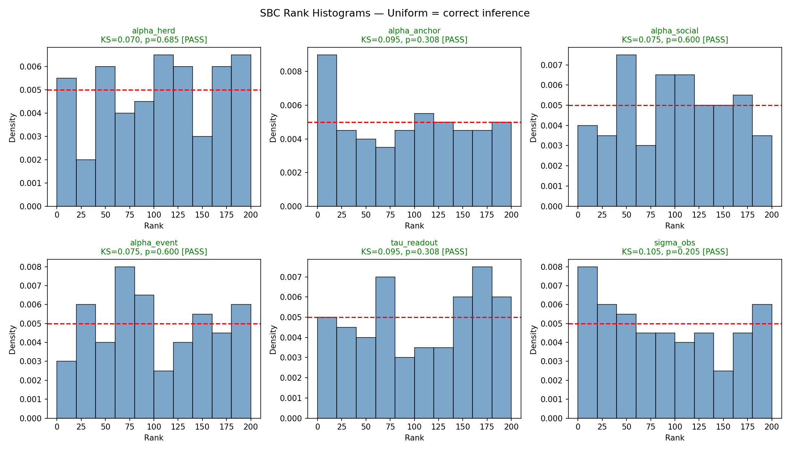

# SBC (Simulation-Based Calibration) Report

**Generated:** 2026-03-30 13:30

## Configuration

- Instances: 100 (succeeded: 100)
- Inference method: NUTS (200 warmup + 200 samples)
- Posterior samples: 200
- Agents per scenario: 10, Rounds: 7
- Model: Normal(0, 0.3) prior + per-round Normal likelihood
- Total time: 297.6s (5.0min)

## Results

| Parameter | N | KS Statistic | p-value | Verdict |
|---|---|---|---|---|
| alpha_herd | 100 | 0.0700 | 0.6847 | **PASS** |
| alpha_anchor | 100 | 0.0950 | 0.3078 | **PASS** |
| alpha_social | 100 | 0.0750 | 0.6004 | **PASS** |
| alpha_event | 100 | 0.0750 | 0.6004 | **PASS** |
| tau_readout | 100 | 0.0950 | 0.3078 | **PASS** |
| sigma_obs | 100 | 0.1050 | 0.2052 | **PASS** |

## Interpretation

**All parameters PASS the KS uniformity test (p > 0.05).**

This confirms that:
- The JAX simulator is correctly differentiable through NUTS
- The per-round Normal likelihood is well-specified
- The NUTS sampler recovers correct posteriors
- The readout (soft sigmoid pro_fraction) is consistent with the generative model

The inference pipeline is validated for use in the hierarchical calibration.

## Rank Histograms

