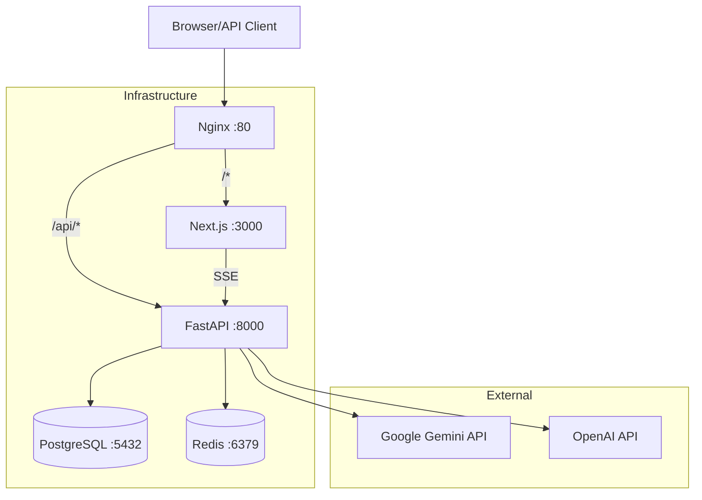
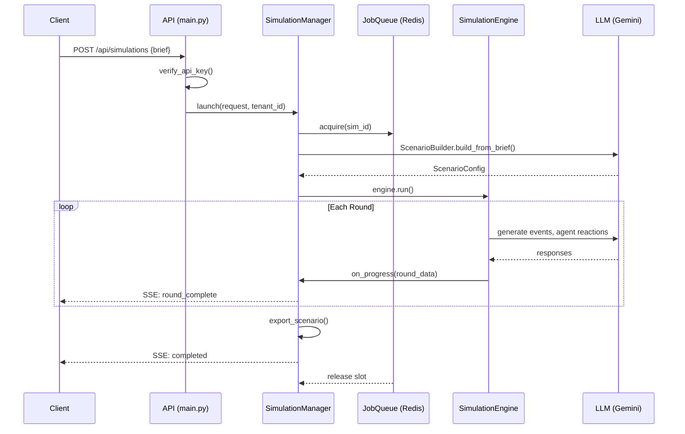

# Architecture

## System Overview

## Request Flow

### Simulation Launch

## Internal Components

### Backend Stack

| Component | Module | Purpose |
|-----------|--------|---------|
| API Server | `api/main.py` | FastAPI endpoints, middleware |
| Auth | `api/auth.py` | API key → tenant mapping |
| Rate Limiter | `api/rate_limiter.py` | Per-tenant request limits |
| Simulation Manager | `api/simulation_manager.py` | Lifecycle, streaming, wargame |
| Database | `api/db.py` | PostgreSQL async layer |
| Job Queue | `api/job_queue.py` | Redis distributed semaphore |
| Middleware | `api/middleware.py` | Request logging, timing |
| Metrics | `api/metrics.py` | Prometheus instrumentation |
| Scenario Builder | `briefing/scenario_builder.py` | Brief → ScenarioConfig via LLM |
| Engine | `core/simulation/engine.py` | Round execution, agent orchestration |
| Opinion Dynamics | `core/simulation/opinion_dynamics_v2.py` | Calibrated force model |
| Agents | `core/agents/` | Elite, Institutional, Citizen |
| Platform | `core/platform/` | Social media simulation |
| Domains | `domains/` | 6 pluggable domain modules |

### Frontend Stack

| Component | Path | Purpose |
|-----------|------|---------|
| Dashboard | `app/page.tsx` | Scenario list, launch new |
| Scenario View | `app/scenario/[id]/` | Results dashboard |
| Replay | `app/scenario/[id]/replay/` | Real-time simulation replay |
| Wargame | `app/wargame/` | Interactive wargame UI |
| Backtest | `app/backtest/` | Financial backtest results |
| Replay Engine | `lib/replay/` | Playback, timeline, animations |
| Schemas | `lib/schemas.ts` | Zod runtime validation |
| API Client | `lib/api.ts` | Typed fetch with validation |

## Data Flow

### Persistence

- **Simulations**: PostgreSQL `simulations` table (or `simulations.json` fallback)
- **LLM Usage**: PostgreSQL `llm_usage` table
- **Checkpoints**: JSON files in `outputs/{scenario}/`
- **Exports**: JSON + Markdown in `outputs/exports/scenario_{id}/`
- **Job Queue**: Redis sets + keys with TTL

### Multi-Tenancy

Each tenant's data is isolated:
- Simulations are tagged with `tenant_id`
- List/get operations filter by tenant
- Export directories can be tenant-scoped
- Usage tracking is per-tenant
